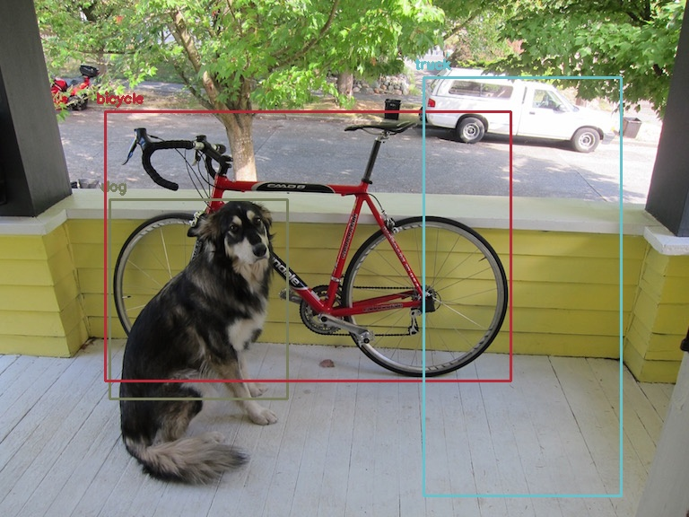

# YOLOv3 pretrained model implementation using Python



# Implemetation-
## Step-1
Download this repository and extract it at the desired location.

## Step-2
Download the weights for this model by clicking [here](https://pjreddie.com/media/files/yolov3.weights) and place it in the extracted repository folder with the other files.

## Step-3
Open a terminal window in the extracted repository folder.

## Step-4
Enter the following command in the terminal window 
```
python script.py -i test.jpg -c yolov3.cfg -w yolov3.weights -cl yolov3.txt
```

## Result 
An image named object-detection.jpg will be created in the same folder with boxes around the objects detected in the image (image added here to match output).

Note- Assumed operating system is windows.

#### Keep working👍 Keep grinding💪 Thank You✌️
